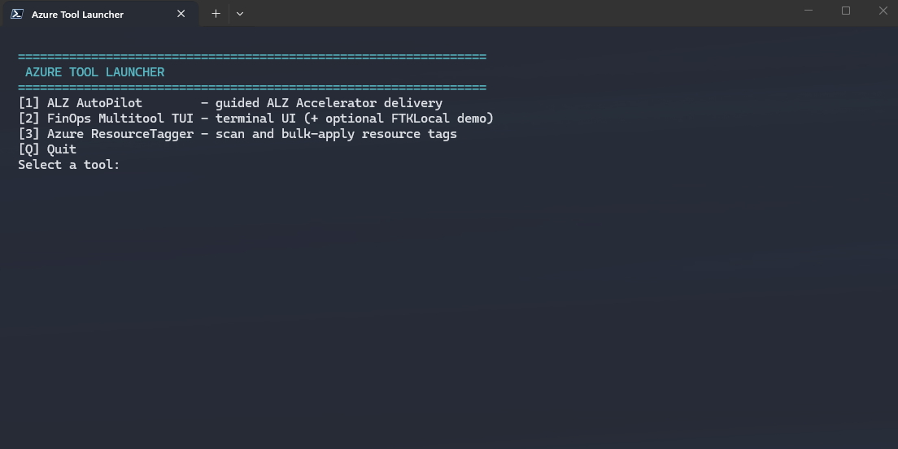

# Azure Tool Launcher

A Windows console menu for existing installations of **ALZ AutoPilot**,
**FinOps Multitool TUI**, and **Azure ResourceTagger**, with optional
**FTKLocal** and **synthetic demo** entries under FinOps.

The launcher does not bundle, install, update, or authenticate any of the tools.
It opens each one in a separate PowerShell window, leaving the menu available.
Downloaders configure their own paths; no particular username or folder layout
is required.



## Prerequisites

- Windows and **PowerShell 7.4+** (`pwsh`). ResourceTagger is a Windows WPF app;
  the FinOps option uses the **terminal UI**, not the former WPF scanner.
- An existing [ALZ AutoPilot](https://github.com/z-larsen/ALZ-AutoPilot)
  checkout, including `Start-ALZDelivery.ps1`.
- The [standalone FinOps Multitool TUI preview](https://github.com/z-larsen/FinOps-Multitool-TUI)
  ([download ZIP](https://github.com/z-larsen/FinOps-Multitool-TUI/archive/refs/heads/main.zip)).
  This is an unofficial standalone preview snapshot.
  Extract it and set `FinOpsToolkitRoot` to the folder containing
  `Public\Start-FinOpsMultitool.ps1` and `Private\FinOpsMultitool`.
  A source installation also works if it contains those files under `src\powershell`.
  The launcher recognizes both layouts, preferring `src\powershell` when present;
  it does not fetch tools or substitute the old WPF scanner.
- An existing [Azure ResourceTagger](https://github.com/z-larsen/AzureResourceTagger)
  checkout, including `Start-ResourceTagger.ps1`.
- Each tool's own dependencies, Azure permissions and sign-in requirements.
  Configure those using the tool's documentation in PowerShell 7.

## Download and configure

Clone this repository or choose **Code > Download ZIP** on GitHub and extract it.
Open PowerShell 7 in the extracted launcher folder:

```powershell
Copy-Item .\launcher.example.psd1 .\launcher.local.psd1
notepad .\launcher.local.psd1
```

Edit the paths in [launcher.local.psd1](launcher.local.psd1) to match your
installations. [launcher.example.psd1](launcher.example.psd1) assumes this layout:

```text
C:\Tools\
    AzureToolLauncher\
    ALZ-AutoPilot\
    FinOps-Multitool-TUI\
    AzureResourceTagger\
```

Paths may be absolute or relative to the **configuration file's folder**, not
the terminal's working directory. Spaces and brackets are supported. Inside a
single-quoted PSD1 string, escape an apostrophe by doubling it (`O''Brien`).
Environment-variable expressions and `~` are not expanded; use a real path.
Only configure trusted, locally installed scripts.

GitHub's source ZIP normally extracts to `FinOps-Multitool-TUI-main`; either
rename that folder to match the example or use its actual name in your settings.
The setting remains named `FinOpsToolkitRoot` for compatibility with existing
configurations, even when it points at the standalone preview.

The personal configuration is ignored by Git. Do not force-add it or put
credentials, reports or customer data in this repository.

If `launcher.local.psd1` doesn't exist, the launcher uses `launcher.example.psd1`,
so it opens right after download. From the menu, a tool starts only when you
select it and its files exist at the configured path; otherwise the menu reports
what's missing and stays open. Before a tool starts, the launcher shows the
script path it runs.

```powershell
.\Start-AzureToolLauncher.ps1 -Check
.\Start-AzureToolLauncher.ps1
```

`-Check` verifies entry-point files and the TUI's core files without launching
anything. It is **not** a check of Azure access, all dependencies, Docker health,
or tool compatibility. Missing configured files produce an error; unconfigured
FTKLocal and synthetic demo entries are optional.

## Menu

```text
[1] ALZ AutoPilot
[2] FinOps Multitool TUI
    [1] Live / connected environment
    [2] Local demo (FTKLocal)
    [3] Synthetic demo (Contoso)
    [B] Back
[3] Azure ResourceTagger
[Q] Quit
```

The live option loads the public `Start-FinOpsMultitool` function and **calls
it**, retaining the TUI's data-source, tenant, subscription and scan prompts.
Inherited `FINOPS_HUB_KUSTO_URI` and `FINOPS_HUB_KUSTO_DB` overrides are cleared
for that run to avoid accidentally using a previous demo endpoint. Choose your
real hub within the TUI when needed.

Children use the same PowerShell 7 host as the launcher, with `-NoProfile`,
`-STA`, and `-NoExit`. Startup errors remain visible in the child window;
successful process creation does not mean a tool has completed its own checks.
Closing the launcher does not close running tools. Use each tool's own exit
action, then close its window.

For a different configuration, or to execute a tool in the current terminal:

```powershell
.\Start-AzureToolLauncher.ps1 -ConfigPath 'C:\Tool settings\launcher.local.psd1'
.\Start-AzureToolLauncher.ps1 -Tool FinOps
```

ALZ still asks for a delivery folder. Choose a non-cloud-synced output folder
(for example, `C:\ALZ\MyTenant`) per its guidance. FinOps reports and all other
tool outputs remain governed by the tools, not the launcher.

## Optional FTKLocal

Leave `FTKLocalScript = ''` if you do not use local demos. To enable it, point
the setting at an existing `Start-DemoEnvironment.ps1` installation with
`Start-LocalHubTUI.ps1` and `Setup-LocalFinOpsHub.ps1` beside it. These scripts
are **not bundled here**. `FinOpsToolkitRoot` is passed explicitly as
`-RepoRoot`, so FTKLocal does not use its author-specific default.

The existing FTKLocal scripts require the **`src\powershell` source layout**
(`src\powershell\Public\Start-FinOpsMultitool.ps1`), not the standalone
preview layout. Continue using a compatible source installation for this option.
If you only downloaded the standalone TUI, leave `FTKLocalScript` empty;
the live TUI option works without FTKLocal. The launcher reports a layout error
before starting Docker when this combination is incompatible.

Follow that installation's prerequisite instructions (Docker Desktop with Linux
containers, sufficient memory, and its data-ingestion dependencies). Selecting
the demo can start Docker, download images and sample data, and create a local
hub on first run. No rebuild/reset flag is added by this launcher.

**This is not an offline-only or fully synthetic Azure session.** The existing
FTKLocal setup serves synthetic hub cost data, but other scans and tenant
selection can still access/show real Azure information. Verify the hub source
in the TUI and limit scans according to your FTKLocal version before sharing
your screen. Check that its sample dataset paths are correct on your machine.

## Optional synthetic demo

Leave `FinOpsDemoScript = ''` if you don't have the FinOps Multitool demo
harness. To enable it, point the setting at that harness's `Start-Demo.ps1`,
with `_DemoAzureMocks.ps1`, `Public\Start-FinOpsMultitool.ps1`, and
`Private\FinOpsMultitool` beside it. The harness is **not bundled here**.

The harness runs its own copy of the TUI with stand-in Az modules and invented
"Contoso Demo" data. The launcher doesn't isolate it from Azure; that depends on
the harness itself. It doesn't use
`FinOpsToolkitRoot`, and the launcher clears inherited `FINOPS_HUB_KUSTO_URI`
and `FINOPS_HUB_KUSTO_DB` overrides for the run, the same as the live option.
The launcher only starts the harness; its menus, data, and reports come from
the harness version you installed. Check its DEMO MODE banner before sharing
your screen.

## Desktop shortcut

```powershell
.\New-LauncherShortcut.ps1
```

Creates **Azure Tool Launcher.lnk** on your Windows desktop, using this
checkout's path, local configuration, and the PowerShell icon. An existing
shortcut is not overwritten unless you pass `-Force`. After moving the checkout,
recreate the shortcut. The launcher itself continues to work from any location
when the configured tool paths are valid.

If downloaded scripts are blocked, review them and follow your organization's
script-signing/execution-policy requirements. The launcher does not bypass
execution policy or request elevation.

## Validation

Tests use temporary stub tools; they do not authenticate, scan Azure, start
Docker, or launch the real tools.

With Pester 5.x and PSScriptAnalyzer installed in PowerShell 7:

```powershell
Import-Module Pester -MinimumVersion 5.0 -MaximumVersion 5.99
Invoke-Pester .\tests\Launcher.Tests.ps1 -Output Detailed
Invoke-ScriptAnalyzer -Path .\Start-AzureToolLauncher.ps1
Invoke-ScriptAnalyzer -Path .\New-LauncherShortcut.ps1
```

This repository is a convenience launcher. The tools remain separate projects
with their own licenses, support policies, prerequisites, and release cycles.
